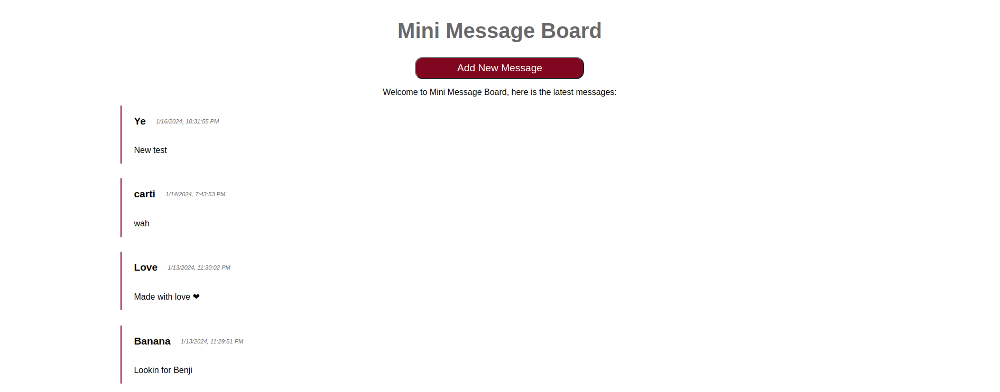
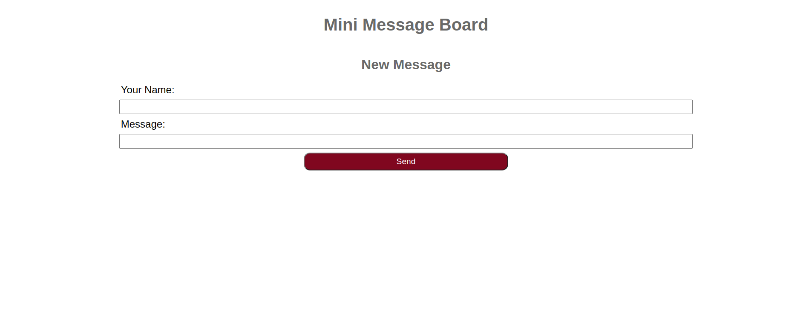

# Mini Message Board

A mini message board is a simple web application that allows users to leave messages on a public board. Users can post messages and view a list of all messages that have been posted.

Click here to see the [live demo](https://mini-message-board-rttb.onrender.com).

## Technologies

This project uses the following technologies:

- Node.js: A JavaScript runtime environment that executes JavaScript code outside of a web browser.
- Express: A web framework for Node.js that provides features for web and mobile applications.
- EJS: A templating language that lets you generate HTML markup with JavaScript.
- MongoDB: A document-based database that stores data in JSON-like format.
- Mongoose: An object data modeling (ODM) library that provides a schema-based solution to model your application data and interact with MongoDB.
- Docker: A tool for building and running containerized applications.

## Screenshots




## Features

Mini Message Board has the following features:

- **Simple and intuitive interface**: The mini-message-board app has a user-friendly design that allows users to easily post and view messages on a public board. Users can also see the date and time of each message.
- **Docker and docker-compose**: The app is dockerized, meaning it can run inside a container that isolates it from the host environment. This makes the app more portable and easier to deploy. The app also uses docker-compose, a tool that lets you define and run multiple containers with a single command.

## Installation

There are two ways to install and run this app: using node and npm, or using docker.

### Using node and npm

- Make sure you have Node.js and npm installed on your machine.
- Clone this repository ```git clone https://github.com/aboelsooud/mini-message-board.git``` or download the source code.
- In the project directory, create a **.env** file with the following variables:
```shell
PORT=8000 # or any port you want
MONGO_URI=mongodb://localhost:27017/mini-message-board # or your MongoDB connection string
```
- Run ```npm install``` to install the dependencies.
- Run node ```app.js``` or ```npm start``` to start the server.
- Open ```http://localhost:8000``` in your browser to view the app.

### Using docker

- Make sure you have Docker and Docker Compose installed on your machine.
- Clone this repository ```git clone https://github.com/aboelsooud/mini-message-board.git``` or download the source code.
- In the project directory, create a **.env** file with the following variables:
```shell
PORT=8000 # or any port you want
MONGO_URI=mongodb://localhost:27017/mini-message-board # or your MongoDB connection string
```
- In the project directory, run `docker-compose up` to build and start the containers.
- Open ```http://localhost:8000``` in your browser to view the app.

# Contributing

This project is open for contributions. If you want to add a new feature or fix a bug, please fork the repository and create a pull request. You can also open an issue to report a problem or suggest an improvement.
